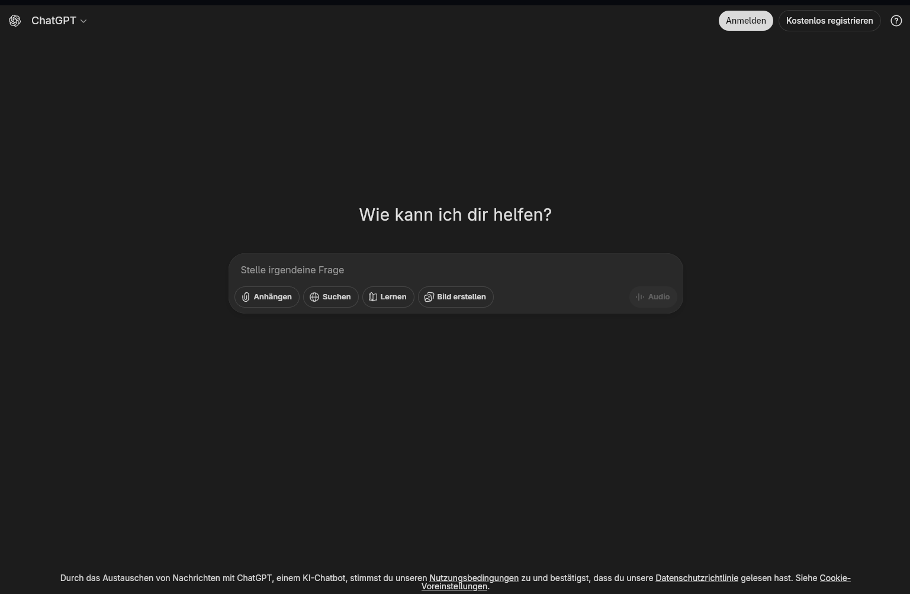
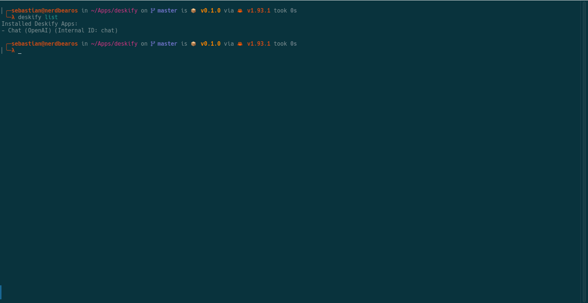
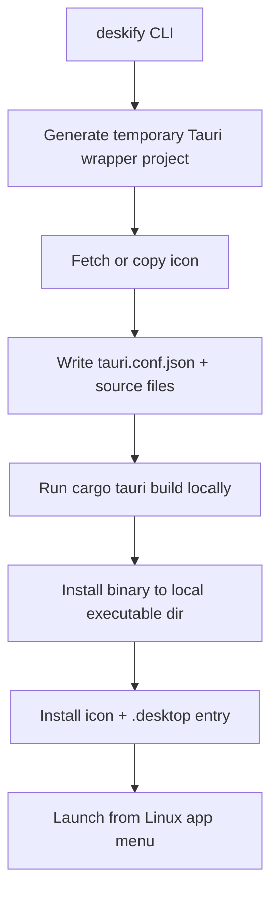
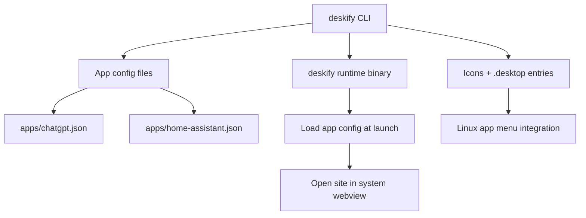

<h1 align="center">deskify</h1>

<p align="center">
  <b>Turn websites into first-class Linux desktop applications with Rust, Tauri, and the system WebView.</b><br>
  Build native-feeling, standalone web app wrappers with CLI-first Linux integration.
</p>

<p align="center">
  
  
  
  
  
  
  
</p>

<p align="center">
  
  
</p>

<p align="center">
  
</p>

<p align="center"><sub>Screenshots: KDE Plasma on Arch Linux (alpha MVP workflow).</sub></p>

---

## Quick Start

Two tracks, depending on what you want:

### Option A: Chromium mode (fastest, best compatibility)

Requirements: any Chromium-based browser installed (`chromium`, `google-chrome`, `brave`, etc.)

```bash
mkdir -p ~/.local/bin
curl -L -o ~/.local/bin/deskify \
  https://github.com/spalencsar/deskify/releases/latest/download/deskify-linux-x86_64
chmod +x ~/.local/bin/deskify

# If `deskify` is not found, ensure ~/.local/bin is in PATH (common on Ubuntu/Debian):
command -v deskify >/dev/null || { echo 'export PATH="$HOME/.local/bin:$PATH"' >> ~/.bashrc && source ~/.bashrc; }

deskify build --url "https://chat.com" --name "Chat" --backend chromium
```

### Option B: Native Tauri mode (system WebView, no Chromium dependency)

Follow the full install section below (Tauri/WebKitGTK prerequisites), then:

```bash
deskify build --url "https://chat.com" --name "Chat"
```

## Why Deskify Exists

Web apps are now core tools, but Linux desktops still treat them like second-class citizens.

- Electron-based wrappers solve distribution, but often at high RAM/disk cost.
- PWAs help in some browsers, but desktop integration is inconsistent across environments.
- The original [Nativefier](https://github.com/nativefier/nativefier) proved the need, but it is now unmaintained.

`deskify` takes a Linux-first approach: it turns a website into a native-feeling desktop app using [Tauri](https://tauri.app/) and the system webview (for example `webkit2gtk`) instead of bundling a full browser engine per app.

## Problem Fit (Why Deskify vs. Other Approaches)

Deskify is optimized for Linux users who want native desktop integration and CLI-friendly automation for web apps, without shipping a bundled browser runtime per app.

The comparison below is intentionally rough and practical (not benchmark marketing). It describes tradeoffs, not winners in every category.

| Approach | Runtime model | Desktop integration | Automation / scripting | Isolation / sandbox | Setup complexity | Offline capability |
| --- | --- | --- | --- | --- | --- | --- |
| Electron / Nativefier | Bundled Chromium per app | Good | Low to medium | Per-app process, app-bundled runtime | Easy to medium | Depends on the site |
| PWA | Browser runtime | Limited / browser-dependent | Low | Shared browser context | Very easy | Depends on browser + site |
| Flatpak web app models | Sandbox-oriented runtime model | Good | Limited | Strong sandbox model | Medium | Depends on runtime + site |
| **Deskify** | System WebView | Native (`.desktop`, icons, WMClass) | **High (CLI-first)** | Medium (shared system WebView security model) | Medium (Tauri prerequisites) | Depends on the site |

### Deskify Focus (Today)

Deskify focuses on:

- system-native Linux desktop integration
- minimal runtime overhead by relying on the system WebView
- automation-friendly CLI workflows
- straightforward local install/remove lifecycle management

Deskify intentionally does not aim to:

- replace full browser sandbox products
- provide a cross-platform abstraction layer
- ship bundled browser runtimes per generated app

## How Deskify Works Today (Alpha / MVP)

`deskify` is ready for public use and testing as an **early MVP**, but it is **not production-hardened yet**.

- **Platform scope:** Linux only
- **Current architecture:** one generated Tauri wrapper project per app
- **Build model:** `deskify` compiles the wrapper locally on your machine
- **Why this MVP design:** simpler debugging, isolated failures, low contributor complexity
- **Tradeoff:** build time and distro-specific setup issues become user-facing
- **Test coverage:** 37 unit tests covering desktop entry escaping, Tauri config generation, validation, Chromium backend, and app config serialization

### MVP Architecture (Today)



### Known Limitations

- Requires Tauri/Linux system dependencies to be installed locally before `deskify build`
- Generated app build success can vary by distro/system setup (WebKitGTK/Tauri prerequisites)
- Some modern sites fail or degrade in the system WebView backend (`tauri`) due to engine/runtime differences
- No official cross-platform support (Windows/macOS) yet
- GitHub Releases / binary automation for `deskify` itself may lag behind source updates during early MVP
- DRM/protected-media services may not work reliably in the system WebView backend even if they work in a full browser (depends on WebView/DRM support)

## Where Deskify Is Going

Deskify aims to make web applications **first-class Linux desktop applications**.

Planned evolution (direction, not promise):

- Shared runtime model for multiple apps
- Per-app config and icon installs without full rebuilds
- Stronger Linux desktop integration (deployment, automation, kiosk/admin workflows)
- Better distro compatibility guidance and troubleshooting

The current per-app build approach is intentional for the MVP. The goal is to keep it simple now while making the longer-term direction visible.

### Planned Evolution (Concept)



## Why Not Just Use Flatpak Web Apps / PWAs / Electron?

The table above covers the technical tradeoffs in more detail. In practice, `deskify` is most useful when you want:

- a CLI-first workflow for repeatable installs and automation
- Linux-native desktop integration (`.desktop`, icons, window class behavior)
- a system-WebView-based runtime model instead of shipping a bundled browser per app

### Key Features
- **System-WebView Runtime Model:** Generated wrappers stay small because Deskify relies on the system WebView instead of bundling a browser runtime per app.
- **Automatic Icon Fetching:** Scrapes high-quality 128x128 favicons automatically using the Google Favicon API.
- **Layered Icon Fallbacks:** Tries site-provided icons first (`<link rel="icon">`, `/favicon.ico`), then falls back to the Google Favicon API, then a dummy icon.
- **XDG-Compliant System Integration:** Safely creates `.desktop` entries in `~/.local/share/applications` and manages application icons in `~/.local/share/icons/hicolor/`.
- **Wayland/X11 Ready:** Perfectly binds `StartupWMClass` to ensure your DE groups the app exactly to its custom icon (no generic gear icons in GNOME/KDE taskbars).
- **Kiosk / Fullscreen Mode:** Pin applications perfectly as dashboards.
- **User-Agent Spoofing:** Trick picky sites (like WhatsApp Web) into working within the webview.
- **Clean App Management:** Effortlessly list and remove created apps without leaving orphaned files behind.

---

## 🚀 Installation

### Option A: Install a prebuilt binary (recommended)

Deskify provides Linux release binaries. Download the latest release and install it into `~/.local/bin`:

```bash
mkdir -p ~/.local/bin
curl -L -o ~/.local/bin/deskify \
  https://github.com/spalencsar/deskify/releases/latest/download/deskify-linux-x86_64
chmod +x ~/.local/bin/deskify
deskify --help
```

Notes:

- The `tauri` backend still requires Tauri/WebKitGTK system dependencies to build wrappers locally.
- The `chromium` backend does not require Tauri prerequisites (but it requires an installed Chromium-based browser).

### Arch Linux (AUR)

An AUR package is available (prebuilt binary package):

```bash
yay -S deskify-bin
```

⚠️ The AUR package tracks **alpha** tags (`v0.1.0-alpha.N`). Expect occasional breaking changes during early development.

### Option B: Build from source (Tauri mode)

### 1. System Dependencies
Because `deskify` compiles Tauri applications natively on your machine, you need the standard Tauri prerequisites installed before using it.

On **Ubuntu / Debian**:
```bash
sudo apt update
sudo apt install libwebkit2gtk-4.1-dev \
  build-essential \
  curl \
  wget \
  file \
  libssl-dev \
  libgtk-3-dev \
  libayatana-appindicator3-dev \
  librsvg2-dev
```

On **Arch Linux / Manjaro**:
```bash
sudo pacman -S webkit2gtk-4.1 \
  base-devel \
  curl \
  wget \
  file \
  openssl \
  appmenu-gtk-module \
  gtk3 \
  libappindicator-gtk3 \
  librsvg \
  libvips
```

*(For Fedora or other distros, refer to the [Tauri Prerequisites Guide](https://v2.tauri.app/start/prerequisites/).)*

### 2. Rust & Tauri CLI
You'll need the Rust compiler and the Tauri CLI to compile the generated apps.
```bash
# Ensure Rust is installed
curl --proto '=https' --tlsv1.2 -sSf https://sh.rustup.rs | sh

# Install Tauri-CLI globally
cargo install tauri-cli --version "^2.0.0"
```

### 3. Install deskify
Clone the repository and install it directly via Cargo:
```bash
git clone https://github.com/spalencsar/deskify.git
cd deskify
cargo install --path .
```

---

## 🛠️ Usage

### Creating an App (`build`)
The `build` subcommand requires a `--url` and a `--name`.

```bash
deskify build --url "https://chatgpt.com" --name "ChatGPT"
```

Once the build finishes, `ChatGPT` will instantly appear in your system Application Launcher (e.g., Rofi, Wofi, GNOME Dash).

`deskify` derives a safe internal ID from the app name (for example, `ChatGPT` becomes `chatgpt`).

### Backend Modes (`--backend`)

Deskify supports two backend modes:

- `tauri` (default): Uses the system WebView (`webkit2gtk` on Linux). Produces small wrappers and strong Linux desktop integration, but some sites may fail due to engine compatibility.
- `chromium`: Uses an already installed Chromium-based browser (`chromium`, `google-chrome`, `brave`, etc.) in app mode. Better site compatibility and no local Tauri build, but depends on a browser installed on the system.

If a site does not work in the default `tauri` backend, try `--backend chromium`.

Quick decision rule:

- Start with the default `tauri` backend for small wrappers and native Linux integration.
- If the site fails to load, behaves incorrectly, or needs a newer browser engine, rebuild/update with `--backend chromium`.

#### Advanced Build Options
```bash
deskify build \
  --url "https://example.com/dashboard" \
  --name "Dashboard" \
  --fullscreen \
  --user-agent "Mozilla/5.0 (Windows NT 10.0; Win64; x64) Chrome/120.0.0.0 Safari/537.36" \
  --dark-mode \
  --width 1280 \
  --height 720
```

Frameless example (without fullscreen):

```bash
deskify build \
  --url "https://chat.com" \
  --name "Chat" \
  --no-decorations \
  --width 1200 \
  --height 800
```

Preview the generated Tauri config without building/installing:

```bash
deskify build --url "https://chat.com" --name "Chat" --print-config
```

Chromium compatibility mode (no local Tauri build):

```bash
deskify build --url "https://mail.proton.me" --name "Proton Mail" --backend chromium
```

Chromium with shared browser profile (uses existing browser profile/session model):

```bash
deskify build \
  --url "https://app.slack.com" \
  --name "Slack" \
  --backend chromium \
  --profile-scope shared
```

Chromium with explicit browser binary:

```bash
deskify build \
  --url "https://github.com" \
  --name "GitHub" \
  --backend chromium \
  --browser-bin /usr/bin/brave-browser
```

Preview planned actions only (dry run):

```bash
deskify build --url "https://chat.com" --name "Chat" --dry-run
```

* `--icon <PATH>`: Provide a custom PNG icon instead of auto-downloading one.
* `--fullscreen`: Starts the app in Kiosk mode.
* `--no-decorations`: Disables native window decorations (frameless window; useful for dashboards/kiosk setups).
* `--user-agent <UA>`: Useful to bypass webview restrictions on certain platforms.
* `--dark-mode`: Forces the Tauri webview into a dark theme.
* `--width <PX>` / `--height <PX>`: Sets the startup resolution.
* `--backend <tauri|chromium>`: Choose system WebView (`tauri`) or Chromium app mode (`chromium`).
* `--browser-bin <PATH>`: Use a specific Chromium-based browser binary (Chromium backend only).
* `--profile-scope <isolated|shared>`: Chromium backend profile behavior (`isolated` creates a per-app profile under `~/.local/share/deskify/profiles/`).
* `--print-config`: Prints the generated `tauri.conf.json` and exits.
* `--dry-run`: Shows planned actions without building/installing.

Note for Chromium backend:

- `--no-decorations` is best-effort and may be ignored by the browser/window manager.
- `--width` and `--height` are applied together (`--window-size`) only when both are provided.
- Deskify auto-detects a Chromium-based browser from `PATH`, but some distros ship Chromium-based browser commands (Chrome/Chromium/Brave, etc.) as wrapper scripts or use different binary names/paths (for example on BigLinux). If launches fail, set `--browser-bin` to a real browser binary.
- Flatpak-installed browsers are not supported out of the box (they usually require `flatpak run ...`). Use a native browser binary for now; Flatpak support may be added in a future release.

Troubleshooting (find the real browser binary):

```bash
command -v chrome chromium google-chrome google-chrome-stable brave-browser 2>/dev/null
ls -la /usr/bin/chrome /usr/bin/chromium /usr/bin/google-chrome /usr/bin/google-chrome-stable 2>/dev/null
```

### Managing Apps (`list` & `remove`)
You can view all applications generated by `deskify`:
```bash
deskify list
```

Verbose list (includes URL/backend when metadata is available):

```bash
deskify list --verbose
```
*Output:*

```text
Installed Deskify Apps:
- ChatGPT (Internal ID: chatgpt, Backend: tauri)
- Proton Mail (Internal ID: proton-mail, Backend: chromium)
```

To entirely uninstall an app (including the binary, desktop entry, and icons):
```bash
deskify remove chatgpt
```

`remove` expects this **internal ID** (sanitized lowercase letters, numbers, `-`), not the display name.

### Updating Apps (`update`)

Rebuild and reinstall an existing app ID without manually running `remove` + `build`:

```bash
deskify update chat --url "https://chat.com" --name "Chat" --no-decorations
```

Deskify persists app metadata under `~/.local/share/deskify/apps/<id>.json`. With persisted metadata, `update` can be used without `--url`.
If an older app has no metadata yet, provide `--url` once (or rebuild once) to migrate it.
`update <id>` keeps the existing internal ID stable even if you change the display name.

You can also preview an update:

```bash
deskify update chat --url "https://chat.com" --dry-run
deskify update chat --url "https://chat.com" --print-config
```

Switch an existing app to Chromium compatibility mode while keeping the same internal ID:

```bash
deskify update chat --url "https://chat.com" --name "Chat" --backend chromium
```

### Diagnostics (`doctor`)

Check local prerequisites and common environment issues (Rust/Cargo, `cargo tauri`, `pkg-config`, directories):

```bash
deskify doctor
```

`doctor` also checks whether a Chromium-based browser is available in `PATH` for `--backend chromium`.

---

## 🧪 Manual Smoke Test Checklist (Before a Public Release)

```bash
deskify build --url "https://example.com" --name "Example"
deskify list
deskify remove example
```

Also test invalid IDs:

```bash
deskify remove ../foo
deskify remove FooBar
```

Expected: clean validation error and no unintended file deletion.

---

## 🏷️ Versioning & GitHub Releases (MVP)

- Recommended tag format during MVP: `v0.1.0-alpha.N`
- GitHub Releases publish a Linux `deskify` CLI binary on tags (`v*`)

For the latest alpha, see GitHub Releases (and continue with `v0.1.0-alpha.N` for follow-up releases).

---

## 📦 Open Source Acknowledgements

`deskify` is built on the shoulders of giants. It leverages the following fantastic open-source projects:
* **[Tauri](https://tauri.app/)** - The core framework driving the native wrap.
* **[Clap](https://crates.io/crates/clap)** - Command-Line Argument Parser for Rust.
* **[Anyhow](https://crates.io/crates/anyhow)** - Excellent error handling context.
* **[Ureq](https://crates.io/crates/ureq)** - Minimalist sync HTTP request library (used for icon fetching).
* **[Directories](https://crates.io/crates/directories)** - Abstractions for standard OS directories (XDG Base Dirs).

## 📝 License
This project is licensed under the [MIT License](LICENSE).
